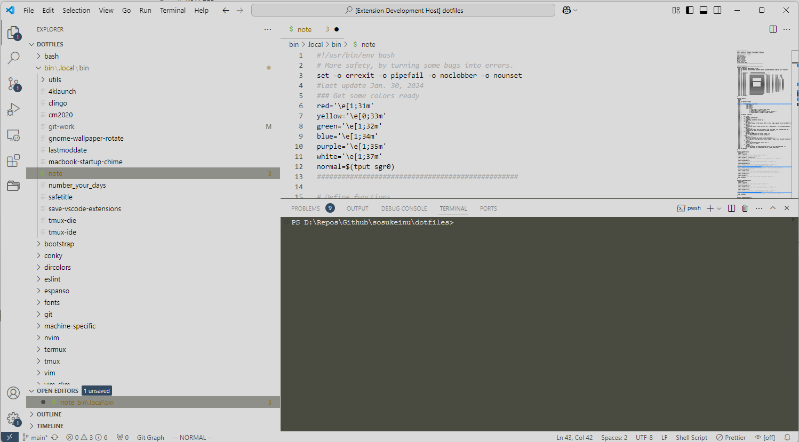
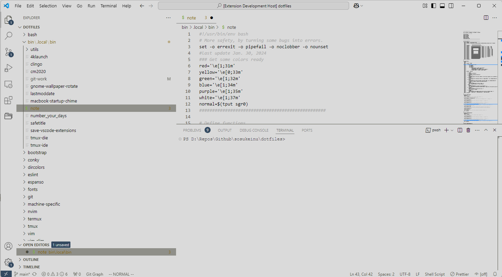
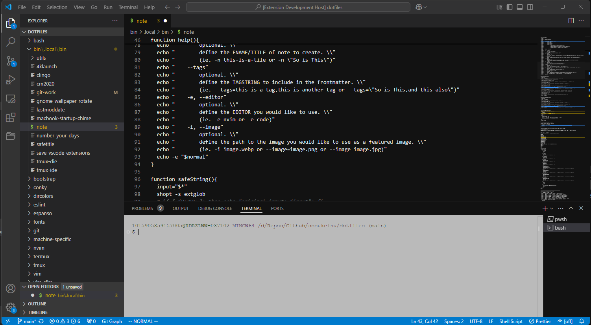
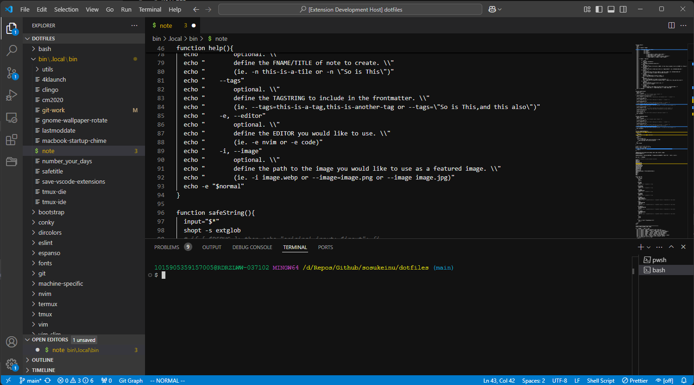
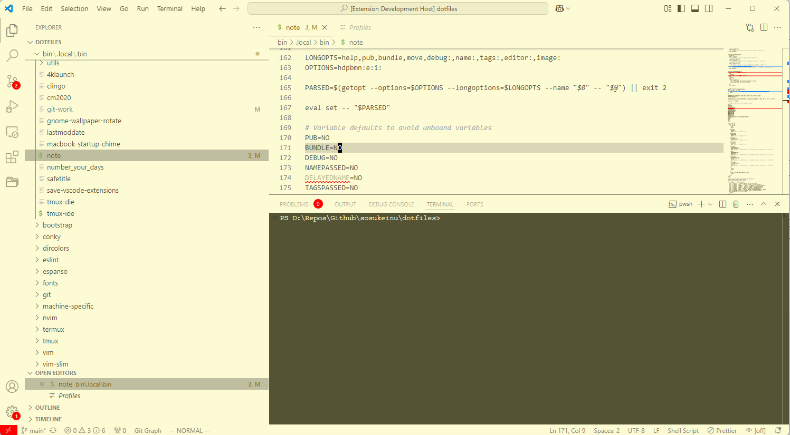
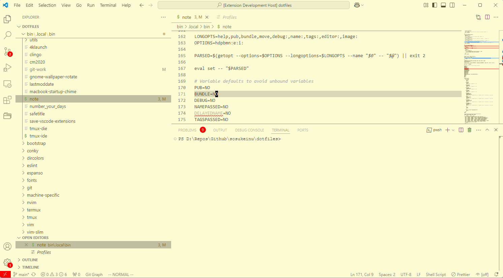
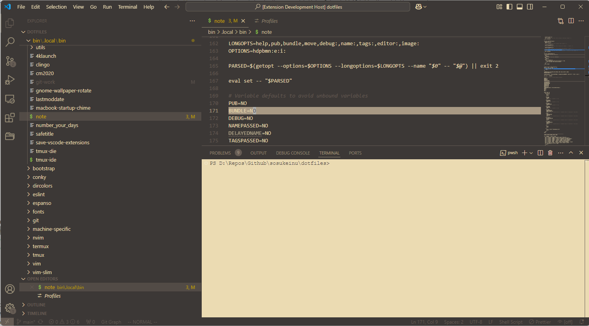
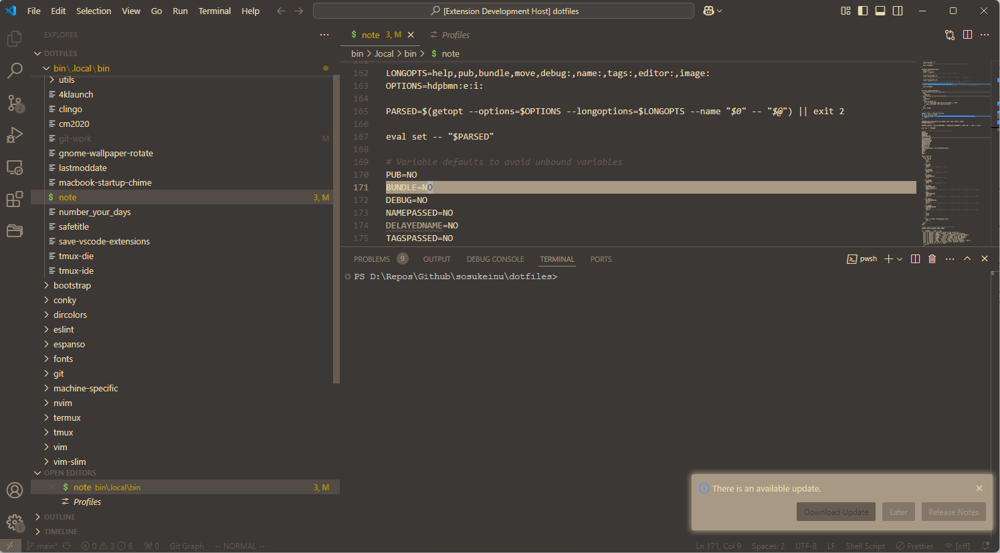
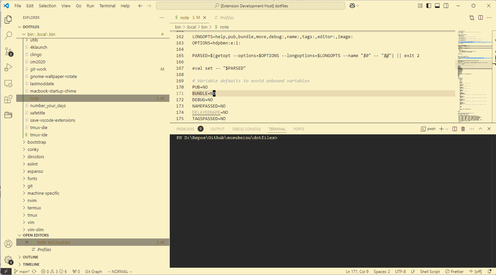
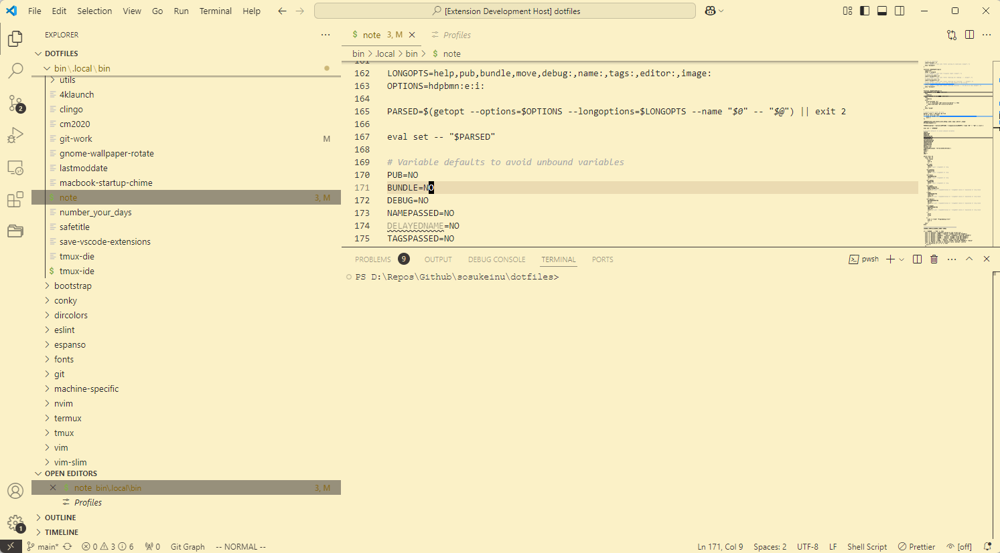

# Nofrils (Sans Syntax Highlighting) Themes for VS Code

Bare-bones syntax coloring theme for VS Code, based on https://github.com/robertmeta/nofrils and https://github.com/urld/vscode-nofrills.git.

Because _simple_ shouldn't mean _ugly_.

**Why no syntax colors?**

- [Robert Melton: Syntax Highlighting Off](https://web.archive.org/web/20170319161234/https://www.robertmelton.com/2016/04/10/syntax-highlighting-off/)
- [Linus Åkesson: A case against syntax highlighting](https://web.archive.org/web/20170319161252/http://www.linusakesson.net/programming/syntaxhighlighting/)
- [Kyle Isom: Through the Looking Glass :syntax off](https://web.archive.org/web/20170319161308/https://kyleisom.net/blog/2012/10/17/syntax-off/)

Damian Conway (of Perl) [^fn00]

[^fn00]: [Wikipedia Entry for Damian Conway](https://en.wikipedia.org/wiki/Damian_Conway)

>"I don’t use a colour scheme at all, and very rarely use syntax highlighting. I find multicoloured code very distracting…almost inducing sensory overload. It much easier to cope with just my standard yellow-on-black terminal window." [^fn01]

[^fn01]: [Damian Conway How I Vim: Who are you and what do you use vim for?](https://web.archive.org/web/20170319161231/http://howivim.com/2016/damian-conway/)

# VS Code Nofrils Light

# VS Code Nofrils Light (Unified)

# VS Code Nofrils Dark

# VS Code Nofrils Dark (Unified)

# VS Code Nofrils Sepia

# VS Code Nofrils Sepia (Unified)

# VS Code Nofrils Gruvbox Dark

# VS Code Nofrils Gruvbox Dark (Unified)

# VS Code Nofrils Gruvbox Light

# VS Code Nofrils Gruvbox Light (Unified)

Install from https://marketplace.visualstudio.com/items?itemName=batteajd.vscode-nofrils.
